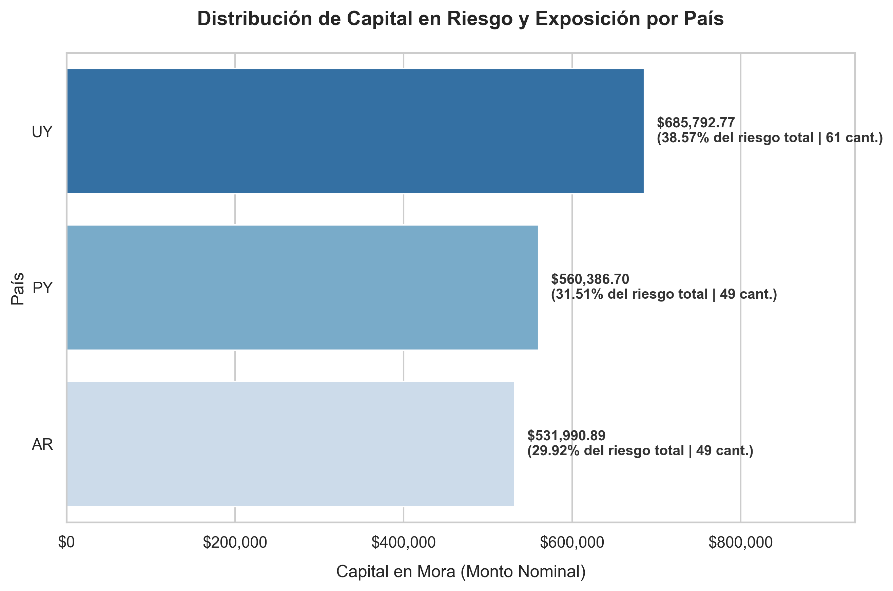
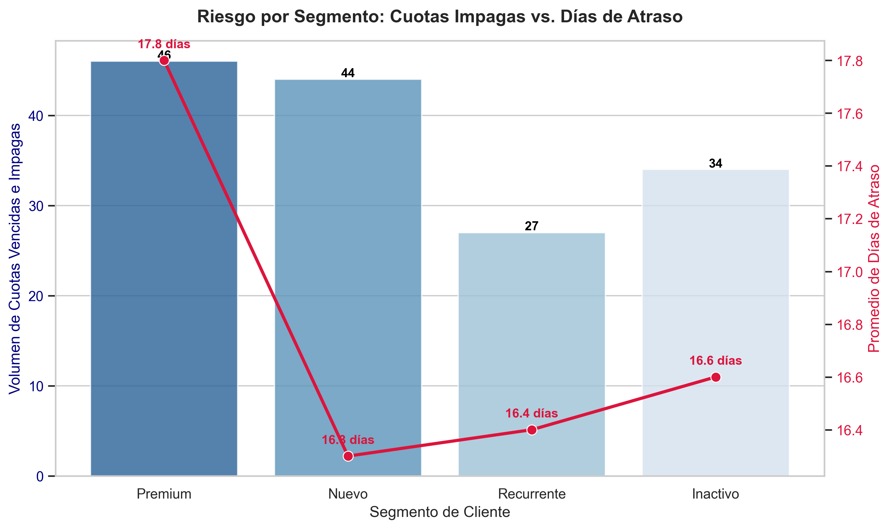

# Análisis de Proyección de Riesgos - Paigo

Este repositorio contiene el análisis de cartera y la evaluación de riesgos crediticios realizado para Paigo. El proyecto aplica análisis exploratorio, auditoría de calidad de datos y consultas SQL analíticas sobre un dataset de **400 préstamos y 1.349 registros de pago**, con el objetivo de identificar patrones de morosidad, segmentar clientes y proponer estrategias accionables de mitigación.

---

## Descripción del Proyecto

El objetivo principal es transformar los datos transaccionales de la cartera en insights de negocio. A través de la carga, auditoría y procesamiento de los datasets, se logró:

- Reclasificar estados de mora detectando inconsistencias entre el sistema y la realidad de pagos.
- Analizar el impacto geográfico del riesgo por país (UY, AR, PY).
- Segmentar el comportamiento de clientes (Premium, Recurrente, Nuevo, Inactivo) para orientar estrategias de cobranza diferenciadas.
- Construir un análisis de aging (buckets de mora) para dimensionar la recuperabilidad real del capital en riesgo.

---

## Tecnologías Utilizadas

- **Python:** Procesamiento de datos y orquestación del análisis.
- **Pandas / NumPy:** Limpieza, estructuración y transformación de datos.
- **DuckDB:** Motor SQL integrado para consultas analíticas de alto rendimiento sobre DataFrames.
- **Matplotlib / Seaborn:** Visualización de distribuciones, correlaciones y métricas de riesgo.
- **OpenPyXL:** Lectura y escritura de archivos Excel (`.xlsx`).

---

## Estructura del Repositorio

```text
ANALISTA-DE-PROYECCION-DE-RIESGO/
├── data/
│   ├── raw/                        # Dataset fuente: cartera y pagos (datasets_riesgo_v2.xlsx)
│   └── clean/                      # Cartera consolidada post-auditoría (cartera_consolidada_limpia.xlsx)
├── docs/                           # Documentación técnica y estratégica (PDFs)
│   ├── insight_accionables.pdf
│   └── uso_de_IA.pdf
├── notebooks/
│   ├── 00_analisis_exploratorio.ipynb   # EDA: distribuciones, correlaciones, bivariante
│   ├── 01_calidad_datos.ipynb           # Auditoría: integridad, nulos, reclasificación
│   └── 02_sql_analitico.ipynb           # Consultas SQL: métricas de negocio, aging y visualizaciones
├── reports/figures/                # Visualizaciones exportadas en alta resolución (PNG)
├── .gitignore
├── README.md
└── requirements.txt
```

---

## Flujo de Análisis

```
datasets_riesgo_v2.xlsx
        │
        ▼
00_analisis_exploratorio.ipynb   →  Perfilamiento, distribuciones, correlaciones
        │
        ▼
01_calidad_datos.ipynb           →  Auditoría SQL, detección de inconsistencias,
                                    reclasificación → cartera_consolidada_limpia.xlsx
        │
        ▼
02_sql_analitico.ipynb           →  Métricas de negocio, segmentación, riesgo geográfico,
                                    aging de mora por producto y país
```

---

## Principales Hallazgos

### 1. Auditoría de Calidad de Datos
- Se detectaron **60 préstamos con inconsistencias críticas**: cuotas vencidas sin pagar (desde 2022) clasificadas erróneamente como "Al día" en el sistema.
- El capital no provisionado asciende a **$263.668,14**, lo que representa un riesgo oculto para la cartera.
- Las pruebas de integridad referencial (100%), consistencia cronológica y unicidad de IDs resultaron satisfactorias.

### 2. Riesgo por Producto
- **Adelanto de Sueldo (32%)** y **BNPL (30,30%)** lideran la tasa de mora, superando en más de **10 puntos porcentuales** a Microcrédito (20,21%) y Préstamo Personal (23,36%).
- El riesgo se concentra en productos de baja barrera de entrada, lo que sugiere revisar las políticas de aprobación.

### 3. Riesgo Geográfico
- **Uruguay (UY)** concentra el **38,57% del capital en mora** ($685.792,77), operando con una TNA promedio del 45%.
- **Argentina (AR)** presenta la menor exposición (29,92%) y el costo de crédito más bajo (42% TNA).

### 4. Segmentación de Clientes
- El segmento **Premium** registra el peor desempeño: mayor promedio de días de atraso (**17,8 días**) y mayor volumen de cuotas vencidas impagas (**46 cuotas**).
- El segmento **Recurrente** es el más eficiente para el flujo de caja (sólo 27 cuotas vencidas impagas).
- El segmento **Nuevo** muestra morosidad temprana considerable (44 cuotas), aunque regulariza rápido cuando paga (16,3 días promedio).

### 5. Canal de Adquisición
- **Alianza Comercial** concentra el mayor capital en mora absoluto ($449.826,98) con la mayor tasa de incidencia (43,82%).
- El canal **Orgánico** presenta el ticket de deuda promedio más alto por deudor ($12.115), evidenciando riesgo por magnitud, no por volumen.

### 6. Aging de Mora (Análisis de Recuperabilidad)
El aging revela que el riesgo no es homogéneo ni en severidad ni en origen geográfico o por producto.

**Distribución general de la cartera:**

| Bucket | Préstamos | Capital expuesto | % cartera |
|---|---|---|---|
| Al día | 241 | $2.294.329,60 | 56,34% |
| Mora temprana (1-30d) | 53 | $670.560,72 | 16,47% |
| Mora media (31-60d) | 46 | $434.813,75 | 10,68% |
| Mora grave (61-90d) | 32 | $377.759,89 | 9,28% |
| Mora crítica (+90d) | 28 | $295.036,00 | 7,24% |

**Por producto:** Préstamo Personal domina el capital en todos los buckets de mora. BNPL es el producto con peor tasa de migración: entra en mora media con 8 préstamos y llega a mora crítica con 6, lo que indica baja recuperación una vez que el cliente entra en atraso.

**Por país:** El riesgo no es homogéneo geográficamente y responde a dos problemas distintos:
- **UY** concentra mora antigua de difícil recupero: lidera mora grave ($177k) y mora crítica ($166k), casi el doble que AR y el triple que PY en ese bucket.
- **PY** está generando mora nueva activamente: lidera mora temprana con $262k y 9 préstamos, señal de un problema de originación reciente.
- **AR** es el mercado más manejable: sus clientes entran en mora pero una parte se recupera antes de llegar a mora crítica.

> **Conclusión:** UY requiere gestión de recupero y evaluación de castigo contable para los +90 días. PY requiere revisión de políticas de aprobación. BNPL requiere intervención temprana de cobranza dado que su tasa de recuperación espontánea es muy baja.

---

## Visualizaciones

### Capital en Riesgo por País


### Riesgo por Segmento: Cuotas Impagas vs. Días de Atraso


---

## Metodología de Validación

- Las métricas SQL fueron auditadas comparando resultados entre DuckDB y los registros fuente en pandas.
- La reclasificación de estados de mora se realizó cruzando la tabla de cartera con el historial de pagos.
- Se utilizaron herramientas de IA como apoyo en la interpretación y redacción, siempre bajo revisión y validación humana.

---

**Autor:** Franco Michele Robotti Alonso  
**Fecha:** Mayo 2026